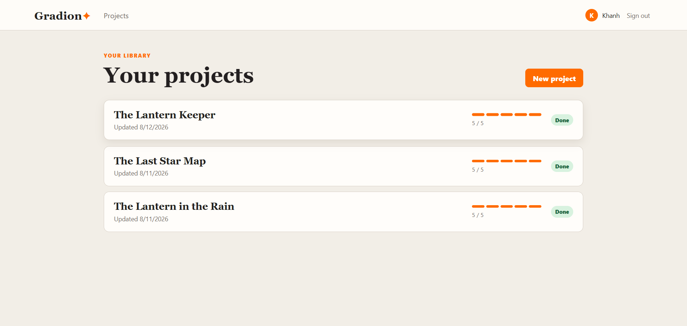
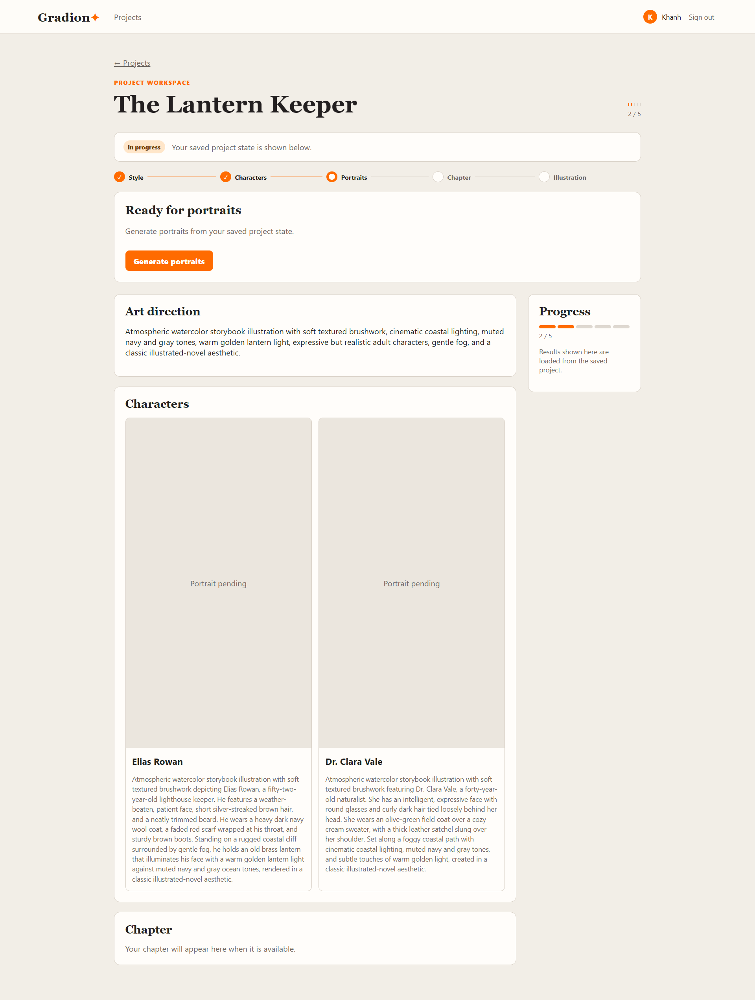
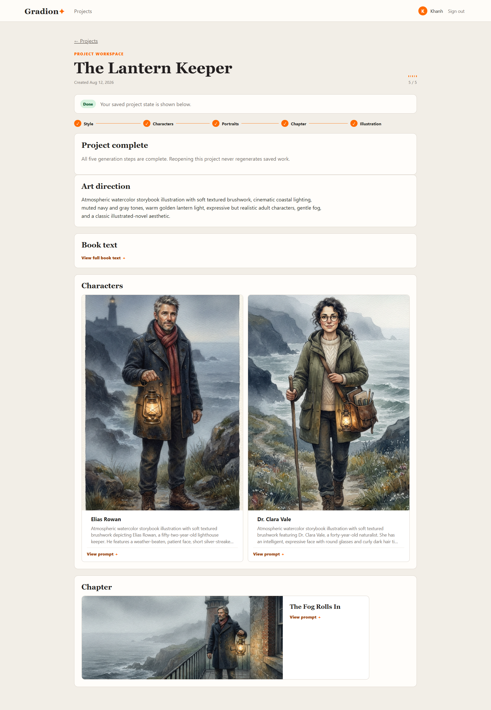

# Gradion Book Illustration Studio

Gradion Book Illustration Studio turns pasted or uploaded book text into a small, persisted illustrated-story workflow powered by the Gemini API.

Each generation action is explicit and user-driven: prepare the reusable book reference, choose or generate the art direction, generate characters and portraits, derive a chapter scene, and finally generate its illustration.

The application is designed to run locally and keeps pipeline progress, generated artifacts, source-book access, and recovery state persisted across refreshes and restarts.

## Preview

> Final screenshots are captured from local UAT. This project is intentionally not publicly deployed.

### Project Library



### Generation Workspace



### Completed Project



## Architecture and Stack

- **Frontend:** React, TypeScript, Vite, TanStack Query
- **Backend:** Express, TypeScript, Drizzle, SQLite via `@libsql/client`
- **Storage:** local filesystem for source books and generated JPEG images
- **Gemini text model:** `gemini-3.6-flash`
- **Gemini image model:** `gemini-3.1-flash-lite-image`

The application is a modular monolith using reduced Clean Architecture principles: feature-oriented frontend modules, constructor-injected backend boundaries, and infrastructure adapters.

The backend dependency flow is:

```text
Route
  ↓
Controller
  ↓
Service
  ↓
Repository / Gemini Adapter / FileStorageService
```

The frontend keeps application composition in `apps/web/src/app`, feature APIs and UI in `features`, shared HTTP/types in `api`, and app-wide visual primitives in `styles`. Gemini and filesystem implementations live under `apps/api/src/infrastructure`; the API composition factory wires them to the feature modules without a DI framework.

Pipeline state is persisted and remains server-authoritative:

```text
STYLE
  ↓
CHARACTERS
  ↓
PORTRAITS
  ↓
CHAPTERS
  ↓
ILLUSTRATIONS
```

The frontend reads persisted backend state instead of maintaining an independent client-side pipeline state machine.

## Key Design Principles

The implementation intentionally favors a small, explicit workflow over background automation.

- Generation is always started by the user.
- Pipeline ordering is enforced by the backend.
- Paid Gemini calls are protected by atomic backend step acquisition.
- Completed work is checkpointed incrementally.
- Failed steps remain retryable.
- Stale `RUNNING` states have explicit recovery actions.
- Refreshing or reopening a project does not trigger generation.
- The frontend does not fabricate completed artifacts.
- Source-book and generated-image filesystem paths remain private.
- Automated tests do not consume Gemini quota.

## Prerequisites

Before running the application, install:

- Node.js 20+
- npm
- a Gemini API key only when deliberately exercising real generation

A Gemini API key is not required for the automated test suite.

## Configuration

Copy `.env.example` to `.env`.

### Windows PowerShell

```powershell
Copy-Item .env.example .env
```

### macOS / Linux

```bash
cp .env.example .env
```

Set a strong local `SESSION_SECRET`.

When testing real Gemini generation, also provide:

```env
GEMINI_API_KEY=your_local_api_key
```

The supported model defaults are documented in `.env.example`:

```env
GEMINI_TEXT_MODEL=gemini-3.6-flash
GEMINI_IMAGE_MODEL=gemini-3.1-flash-lite-image
```

Never commit `.env`, Gemini credentials, or other secrets.

## Quick Start

### First-time setup

Install dependencies:

```bash
npm install
```

Create the local environment file as described above, then initialize the database:

```bash
npm run db:migrate
```

### Start the full stack

```bash
npm run dev
```

This single command starts both applications:

- API: `http://localhost:3000`
- Web: `http://localhost:5173`

Vite proxies relative `/api` requests to the local API, keeping frontend requests same-origin during development.

## Run Tests

Run the complete backend and frontend automated test suite from the repository root:

```bash
npm test
```

Latest verified local result:

```text
Backend
Test Files  26 passed (26)
Tests       115 passed (115)

Frontend
Test Files  5 passed (5)
Tests       33 passed (33)

Total
Test Files  31 passed
Tests       148 passed
Failed      0
```

Automated tests use fake or mocked Gemini boundaries and make no real Gemini generation calls.

See [`TESTING.md`](TESTING.md) for the detailed testing strategy, deliberate exclusions, manual UAT scope, incremental portrait-progress coverage, and the recorded real test report.

## Additional Verification

### API

```bash
npm run typecheck --workspace=apps/api
npm run test --workspace=apps/api
npm run build --workspace=apps/api
```

### Web

```bash
npm run typecheck --workspace=apps/web
npm run test --workspace=apps/web
npm run build --workspace=apps/web
```

### Repository-wide checks

```bash
npm test
npm run typecheck
git diff --check
```

Database migration behavior should also be verified against an isolated fresh database before final submission.

## Main User Flow

1. Enter a name and email to create or reuse a session identity.
2. View projects owned by the current identity.
3. Create a project using exactly one source:
   - pasted book text; or
   - a UTF-8 `.txt` file.
4. Open the project workspace.
5. Read the original source book in full when needed.
6. Explicitly prepare the reusable Gemini book reference.
7. Run the five pipeline steps in order:
   - STYLE
   - CHARACTERS
   - PORTRAITS
   - CHAPTERS
   - ILLUSTRATIONS
8. Watch persisted portrait results appear incrementally while PORTRAITS generation is running.
9. View the generated chapter scene and final illustration.
10. Refresh or return later without restarting completed work.

STYLE accepts optional manual art direction. Leaving the field blank explicitly requests AI-generated art direction.

## Project Workspace

The workspace exposes the persisted project state needed to continue or inspect generation.

It includes:

- project title;
- project creation date;
- current project status;
- five-step pipeline progress;
- explicit generation or retry action;
- art direction;
- full original book text;
- generated characters;
- per-character portrait state;
- generated portraits;
- chapter prompt;
- final chapter illustration.

The workspace does not trigger a Gemini call merely because it is rendered.

## Full Book Text

The original source book is stored privately on the backend filesystem.

It is intentionally not included in the normal project-detail response.

Instead, the frontend loads it through an authenticated, ownership-scoped endpoint only after the user explicitly opens the Book Text disclosure:

```text
GET /api/projects/:projectId/book
```

This separation is important because project detail can be refreshed repeatedly while portraits are being generated. Keeping the manuscript out of the normal detail payload avoids transferring the complete book on every progress refresh.

The Book Text disclosure:

- loads lazily;
- preserves the original full source text;
- keeps line breaks readable;
- uses an internal scroll region for long books;
- caches the loaded text on the client;
- does not trigger Gemini generation;
- does not expose the private filesystem path.

## Pipeline Behavior

The generation workflow is intentionally user-driven.

A step cannot run before its predecessors have completed.

The persisted backend state determines:

- completed step;
- currently running step;
- failed step;
- retry target;
- stale recovery availability;
- generated artifacts.

Refreshes, navigation, and workspace rendering do not fabricate pipeline progress on the client.

### Pipeline Order

```text
STYLE
→ CHARACTERS
→ PORTRAITS
→ CHAPTERS
→ ILLUSTRATIONS
```

The frontend only exposes the currently eligible normal action.

A failed project exposes the persisted failed step as its retry target.

## Incremental Portrait Progress

PORTRAITS is deliberately persisted character by character.

Conceptually:

```text
Character A
PENDING
→ RUNNING
→ DONE
→ portrait persisted

Character B
PENDING
→ RUNNING
→ DONE
→ portrait persisted
```

During an explicit PORTRAITS request, the frontend temporarily refreshes only the active project-detail query.

This allows the UI to show persisted states such as:

```text
PENDING
RUNNING
DONE
FAILED
```

and display the first completed portrait before all portraits have finished.

The frontend does not fabricate percentage progress.

For example, it does not display synthetic values such as:

```text
45%
80%
```

because Gemini does not provide reliable per-image completion percentages.

### Focused Polling

Project-detail polling is intentionally limited to a pending PORTRAITS mutation.

It:

- starts only after the user explicitly clicks Generate portraits;
- refreshes only the active project-detail query;
- runs at a short controlled interval;
- does not refresh the project library continuously;
- does not call Gemini itself;
- stops when the PORTRAITS request succeeds or fails;
- stops when the component unmounts.

No polling is used for:

- STYLE;
- CHARACTERS;
- CHAPTERS;
- ILLUSTRATIONS;
- normal project browsing;
- idle workspaces.

This keeps the implementation small while still satisfying incremental portrait visibility.

## Failure and Recovery

A failed generation step does not reset previously completed work.

The workspace exposes the failed step and allows the user to retry it explicitly.

A stranded `RUNNING` state also has an explicit recovery path so a server interruption cannot leave the project permanently unusable.

No recovery operation runs automatically.

### Retry Behavior

Retry remains backend-authoritative.

For example, when PORTRAITS is retried:

```text
already durable portrait
→ reused

missing/failed portrait
→ generated again
```

The frontend does not choose individual portraits to regenerate.

## Gemini Cost and Persistence Behavior

Gemini usage is deliberately constrained.

- No provider call happens on page load.
- No provider call happens when loading the project library.
- No provider call happens when opening or refreshing a workspace.
- No provider call happens when opening the Book Text disclosure.
- No provider call happens merely because an artifact is rendered.
- Project-detail portrait polling performs only normal backend reads.
- Every generation action requires explicit user intent.
- The backend atomically acquires a pipeline step before performing a paid call.
- Gemini retries are never automatic.
- Pipeline steps never automatically chain into the next step.
- Successful paid outputs are checkpointed durably.
- Failed steps can be retried without discarding completed work.
- Portraits are persisted incrementally so retries can reuse already durable images.
- The source `book.txt` remains durable local source material.
- Gemini Files references are provider-managed resources and are not treated as permanent local storage.

The server also enforces the assessment generation limits instead of relying only on frontend controls.

## Image Handling

Gemini-generated project images are stored locally as JPEG files.

Generated image files are not exposed as public filesystem paths.

Instead, authenticated project-scoped API routes serve persisted portraits and illustrations.

The UI therefore renders backend-provided URLs such as:

```text
/api/projects/:projectId/characters/:characterId/portrait
```

and:

```text
/api/projects/:projectId/chapters/:chapterId/illustration
```

Invalid or unsupported generated image output is rejected before an incorrect durable checkpoint is recorded.

## Prompt Presentation

Generated prompts remain available to the user without dominating the main workspace.

Character and chapter prompts use collapsible disclosures.

For example:

```text
View prompt +
```

expands to reveal the complete persisted generation prompt.

This keeps generated images visually prominent while retaining the AI-generation details for review.

## Session and Ownership

Identity intentionally remains lightweight.

A user starts with:

```text
name + email
```

An existing email reuses the corresponding identity and projects. A new email creates the identity.

Authentication state is represented by the server session.

Project access remains ownership-scoped so authenticated users retrieve only their own projects.

Ownership protection also applies to:

- full source-book text;
- portrait images;
- chapter illustrations;
- generation actions;
- recovery actions.

The frontend uses TanStack Query as the server-state source of truth and centrally handles expired or unauthenticated sessions.

## Project Structure

```text
.
├── apps/
│   ├── api/
│   │   ├── src/
│   │   │   ├── modules/
│   │   │   ├── services/
│   │   │   └── storage/
│   │   └── drizzle/
│   │
│   └── web/
│       └── src/
│           ├── api/
│           └── features/
│               ├── projects/
│               └── session/
│
├── data/
│   ├── books/        # ignored local source-book storage
│   └── images/       # ignored local generated-image storage
│
├── docs/
│   ├── architecture.md
│   ├── plan.md
│   ├── prompts/
│   └── screenshots/  # final README screenshots
│
├── examples/
│   └── Book_illustration.ipynb
│
├── AGENTS.md
├── DECISIONS.md
├── TESTING.md
├── README.md
└── .env.example
```

## Documentation

The repository intentionally keeps the AI-assisted development artifacts used during implementation.

Important files include:

- [`DECISIONS.md`](DECISIONS.md) — engineering decisions, trade-offs, and cases where AI proposals were overridden
- [`TESTING.md`](TESTING.md) — testing strategy, real test results, and manual UAT scope
- [`AGENTS.md`](AGENTS.md) — AI coding context and repository constraints
- [`docs/architecture.md`](docs/architecture.md) — architecture notes
- [`docs/plan.md`](docs/plan.md) — implementation plan and phase progress
- [`docs/prompts/`](docs/prompts/) — saved implementation and review prompts
- [`examples/Book_illustration.ipynb`](examples/Book_illustration.ipynb) — sanitized assessment notebook/reference material

Git history is also part of the development record and reflects incremental implementation phases rather than a single generated code dump.

## Local Storage

The project deliberately uses local storage rather than external object storage.

Runtime data is stored beneath:

```text
data/books/
data/images/
```

These generated/local runtime artifacts are ignored by Git.

The backend stores:

```text
book source
→ data/books/

generated JPEGs
→ data/images/
```

The public API does not expose these filesystem paths.

No S3 bucket, CDN, or external blob-storage service is required.

## Testing Approach

Automated tests cover both success and failure paths.

Backend coverage includes areas such as:

- project ownership;
- pipeline ordering;
- atomic acquisition;
- retries;
- stale recovery;
- Gemini book preparation;
- character generation;
- portrait generation;
- incremental portrait persistence;
- JPEG validation;
- chapter generation;
- illustration generation;
- authenticated full-book retrieval;
- safe storage-read failures.

Frontend coverage includes areas such as:

- session bootstrap;
- identity;
- project creation;
- project navigation;
- pipeline state rendering;
- manual and AI STYLE;
- mutation duplicate protection;
- retry and recovery;
- Book Text lazy loading and caching;
- focused portrait-progress polling;
- persisted portrait and illustration rendering.

Latest automated verification:

```text
31 test files passed
148 / 148 tests passed
0 failed
0 real Gemini calls
```

## Manual UAT

Real Gemini integration is tested separately through a controlled local flow:

```text
Prepare book
→ STYLE
→ CHARACTERS
→ PORTRAITS
→ CHAPTERS
→ ILLUSTRATIONS
```

Manual UAT verifies that:

- generation requires explicit user interaction;
- artifacts remain persisted after refresh;
- the original book remains readable;
- portrait progress becomes visible incrementally;
- persisted portraits survive retries;
- the final chapter illustration remains available after reload;
- stale recovery remains explicit;
- no step automatically runs the next step.

Responsive UI is also reviewed manually at representative viewport widths such as:

```text
390px
768px
1366px
1440px
1920px
```

## Security and Repository Hygiene

The repository does not intentionally contain active secrets.

The previously exposed Gemini credential was revoked/rotated and affected maintained Git history was rewritten before final submission preparation.

The current implementation:

- keeps active Gemini credentials in local environment configuration;
- ignores `.env`;
- does not expose provider file URIs in project DTOs;
- does not expose source-book filesystem paths;
- does not expose generated-image filesystem paths;
- scopes project resources to the authenticated owner.

Local diagnostic logs and generated runtime data are not intended to be committed.

## Deployment

This project is intentionally designed for **local execution only**.

It should not be deployed publicly.

Real generation requires a private Gemini API credential, and the assessment explicitly treats local execution as the intended environment.

A hosted demo is therefore not part of the submission.

## Scope

The implementation covers the required five-step book illustration workflow:

```text
STYLE → CHARACTERS → PORTRAITS → CHAPTERS → ILLUSTRATIONS
```

It intentionally does not add unrelated project-management features such as:

- project deletion;
- project search;
- project filtering;
- project sorting;
- project archiving;
- project duplication.

It also intentionally does not implement later notebook functionality such as:

- video generation;
- music generation;
- text-to-speech narration;
- media mixing;
- audiobook generation.

The focus is the smallest full-stack implementation that preserves:

- correct pipeline ordering;
- server-authoritative state;
- durable persistence;
- incremental image checkpoints;
- explicit paid-call control;
- concurrency protection;
- retry behavior;
- stale recovery;
- ownership;
- readable source material;
- incremental portrait visibility;
- responsive local UI.
